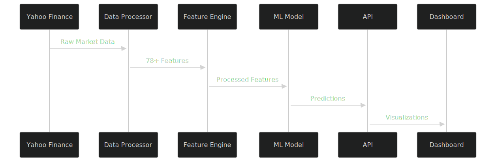
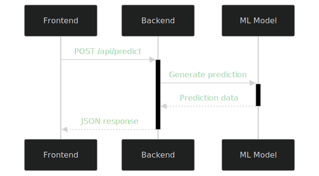

# S&P 500 Market Direction Predictor

A machine learning application that predicts the next-day direction of the S&P 500 index using advanced ensemble methods and comprehensive market features.

## Contents Index

- [Overview](#overview)
- [Installation](#installation)
- [Quick Start](#quick-start)
- [Features](#features)
- [Usage](docs/usage.md)
- [API Reference](docs/api.md)
- [Model Details](docs/model.md)
- [Performance Metrics](docs/performance.md)
- [Testing](#testing)
- [Contributing](#contributing)

## Overview

This project implements an enhanced market prediction system that leverages multiple data sources and machine learning techniques to forecast S&P 500 movement direction. The system combines technical indicators, market sentiment features, volatility metrics, and regime detection to provide probabilistic predictions with confidence intervals.


<div style="text-align:center;">
  
</div>


## Features

### Core Functionality
- **Next-Day Direction Prediction**: Binary classification predicting whether the S&P 500 will move up or down
- **Confidence Scoring**: Probabilistic outputs with confidence intervals for risk assessment
- **Market Regime Detection**: Identifies bull, bear, and sideways market conditions
- **Feature Importance Analysis**: Explains which factors drive predictions
- **Backtesting Framework**: Historical performance evaluation with comprehensive metrics

### Technical Features
- **Advanced Feature Engineering**: 50+ technical and fundamental indicators
- **Ensemble Learning**: Combines Random Forest and Gradient Boosting models
- **Time Series Validation**: Respects temporal order in model validation
- **Real-time Data Integration**: Fetches live market data from Yahoo Finance
- **Web Interface**: Modern dashboard for interactive predictions and analysis

### Market Context Integration
- **VIX Volatility Index**: Fear and greed sentiment measurement
- **Dollar Index (DXY)**: Currency strength impact analysis  
- **Treasury Yields (TNX)**: Interest rate environment consideration
- **Volume Analysis**: Trading activity and liquidity assessment
- **Microstructure Features**: Gap analysis, true range, and price efficiency

## System Architecture


### Pipeline

   <div style="text-align:center;">
   
   </div>

### Core Components

```
sp500_predictor.py    # Main prediction engine and model training
app.py               # Flask web server and API endpoints
run_server.py        # Server initialization and dependency management
config.py            # Configuration settings and parameters
templates/index.html # Web interface dashboard
```

### Data Pipeline

1. **Data Acquisition**: Real-time market data from Yahoo Finance API
2. **Feature Engineering**: Technical indicators, sentiment metrics, regime detection
3. **Model Training**: Ensemble learning with time series cross-validation
4. **Prediction Generation**: Probabilistic forecasts with confidence intervals
5. **Performance Evaluation**: Comprehensive backtesting and metric calculation

## Testing Strategy

This project uses a layered testing strategy to ensure stability and correctness:

- **Unit Tests**: Validate the behavior of individual functions and model components (`Tests/test_sp500_predictor.py`)
- **API Tests**: Ensure REST endpoints are functioning as expected (`Tests/test_api.py`)
- **Acceptance Tests**: Simulate end-to-end user scenarios (`Tests/test_acceptance.py`)
- **Benchmark Tests**:  Measure the performance and efficiency of the system under typical and peak conditions (`Tests/benchmark_tester.py`)

   
    
      | Test Type      | Coverage | Pass Rate 
      |----------------|----------|----------  
      | Unit Tests     | 98%      | 96.7%   
      | API Tests      | 100%     | 100.0% 
      | Acceptance     | 72.2%    | 73.0%  
      | Benchmark      | 83.3%    | 83.3%  


 *Most tests passed. Minor issues remain and are under review.*

### Latest Test Summary (from `Tests/test_report.json`)


## 🔁 Agile Development Process

The development of this system follows **Agile principles**:
- Short iterations with working increments
- Regular code reviews and refactoring
- Continuous testing and validation
- User-centered feedback integration
- Backlog management using GitHub Projects

This allows fast adaptation to new data sources, features, or model improvements while maintaining production quality and stability.


## Installation

### Prerequisites
- Python 3.8 or higher
- Internet connection for market data
- 4GB+ RAM recommended for model training

### Setup Instructions

1. **Clone Repository**
   ```bash
   git clone https://github.com/TiagoAfonseca11/SP500-Ai-Predictor.git
   cd sp500-predictor
   ```

2. **Create Virtual Environment**
   ```bash
   python -m venv venv
   source venv/bin/activate  # On Windows: venv\Scripts\activate
   ```

3. **Install Dependencies**
   ```bash
   pip install -r requirements.txt
   ```

4. **Initialize Application**
   ```bash
   python run_server.py
   ```

### Manual Installation
If automatic setup fails, install dependencies manually:
```bash
pip install flask flask-cors yfinance pandas numpy scikit-learn joblib
```

## Usage

### Web Interface
1. Start the server: `python run_server.py`
2. Open browser to `http://localhost:5002` (In most machines it will open automatically)
3. Use the dashboard to run predictions, backtests, and model training

<div style="text-align:center;">
  
</div>


### Command Line Interface
```bash
python sp500_predictor.py
```
Choose from:
- Daily prediction
- Comprehensive analysis with backtest  
- Model training only

### REST API Endpoints

#### Prediction
```bash
POST /api/predict
```
Returns next-day direction prediction with probabilities and market context.

#### Backtesting
```bash
POST /api/backtest
Content-Type: application/json
{"days_back": 730}
```
Evaluates strategy performance over specified historical period.

#### Model Training
```bash
POST /api/train
```
Trains new model with latest market data.

#### System Status
```bash
GET /api/status
```
Returns system health and model information.

## Model Details

### Feature Categories

**Technical Indicators**
- **Moving averages (5, 10, 20, 50 day)** — *(average closing price over N days, shows trend direction)*
- **RSI (Relative Strength Index)** — *(momentum oscillator showing overbought/oversold conditions)*
- **MACD (Moving Average Convergence Divergence)** — *(tracks momentum by comparing two EMAs)*
- **Bollinger Bands position** — *(relative price position within volatility bands)*
- **Momentum indicators (3, 7, 14 day)** — *(rate of price change over short periods)*

**Market Context**
- **VIX volatility ratio** — *(“fear index” measuring expected market volatility)*
- **Dollar Index changes** — *(strength of the US dollar vs major currencies)*
- **Treasury yield movements** — *(interest rate trends from US government bonds)*
- **Volume analysis** — *(trading activity indicating conviction behind moves)*
- **Price gaps and efficiency** — *(abrupt price moves and how efficiently they are filled)*

**Sentiment Features**
- **Intraday price action** — *(patterns within daily trading range reflecting sentiment)*
- **Volume-price relationships** — *(correlation between price moves and volume spikes)*
- **Fear and greed proxy indicators** — *(custom metrics indicating extreme market sentiment)*
- **Market regime classification** — *(categorizes market into bull, bear, or sideways phases)*

**Microstructure**
- **True Range and Average True Range** — *(measures daily volatility including gaps)*
- **Price efficiency ratios** — *(how smoothly price moves vs. noisy movements)*
- **Gap up/down analysis** — *(studies open price gaps for bullish/bearish signals)*
- **Volatility regime detection** — *(identifies if market is in low or high volatility state)*


### Machine Learning Approach

**Ensemble Architecture**
- Random Forest Classifier (150 estimators, max depth 12)
- Gradient Boosting Classifier (150 estimators, learning rate 0.05)
- Soft voting combination for final predictions

**Validation Strategy**
- Time Series Split cross-validation
- Stratified train/test split
- Walk-forward validation for backtesting

**Performance Optimization**
- Feature scaling with StandardScaler
- Hyperparameter tuning for optimal performance
- Handling of missing values and outliers

## Configuration

### Key Parameters
```python
CONFIDENCE_THRESHOLD = 0.6    # Minimum confidence for trading signals
CACHE_TIMEOUT = 5             # Prediction cache duration (minutes)
DEFAULT_PERIOD = "3y"         # Data lookback period
BACKTEST_PERIOD = "2y"        # Default backtest timeframe
```

### Customization Options
- Adjust confidence thresholds in `config.py`
- Modify feature sets in predictor class
- Configure data sources and symbols
- Set custom training parameters

## Performance Metrics

### Prediction Accuracy
- **Binary Classification Accuracy**: Percentage of correct direction predictions
- **Confidence Calibration**: Alignment between predicted probabilities and outcomes
- **Precision/Recall**: Performance on up vs down predictions

### Trading Strategy Metrics
- **Total Return**: Cumulative strategy performance
- **Sharpe Ratio**: Risk-adjusted returns
- **Maximum Drawdown**: Worst peak-to-trough decline
- **Win Rate**: Percentage of profitable trades
- **Excess Return**: Outperformance vs buy-and-hold

### Risk Metrics  
- **Volatility**: Strategy return standard deviation
- **Beta**: Correlation with market movements
- **Information Ratio**: Active return per unit of tracking error

## Data Sources

### Primary Market Data
- **S&P 500 Index (^GSPC)**: Main prediction target
- **CBOE VIX (^VIX)**: Volatility and sentiment
- **US Dollar Index (DXY)**: Currency impact
- **10-Year Treasury (^TNX)**: Interest rate environment

### Data Quality
- Real-time updates during market hours
- Historical data validation and cleaning
- Missing data interpolation strategies
- Outlier detection and handling

## Troubleshooting

### Common Issues

**Installation Problems**
- Ensure Python 3.8+ is installed
- Use virtual environment to avoid conflicts
- Check internet connection for data downloads

**Model Training Failures**
- Verify sufficient historical data availability
- Check memory requirements for large datasets
- Ensure all dependencies are properly installed

**API Connection Issues**
- Confirm Flask server is running on correct port
- Check firewall settings for local connections
- Verify Yahoo Finance API accessibility

**Data Quality Issues**
- Market holidays may affect data availability
- Weekend predictions use Friday's close data
- Handle missing data with appropriate fallbacks

### Debug Mode
Enable detailed logging by setting `debug=True` in the application configuration.

## Limitations and Disclaimers

### Model Limitations
- **Historical Performance**: Past results do not guarantee future performance
- **Market Regime Changes**: Model may struggle during unprecedented market conditions
- **External Events**: Cannot predict impact of major news or economic announcements
- **Intraday Movements**: Focuses on daily close-to-close predictions only

### Usage Disclaimers
- **Not Financial Advice**: Predictions are for educational and research purposes
- **Risk Warning**: All trading involves substantial risk of loss
- **Data Dependencies**: Relies on external data sources that may be unavailable
- **Computational Requirements**: Complex models require significant processing power

## Contributing

### Development Setup
1. Fork the repository
2. Create feature branch
3. Implement changes with tests
4. Submit pull request with detailed description

### Areas for Improvement
- Alternative data source integration
- Deep learning model experimentation
- Real-time streaming predictions
- Portfolio optimization features
- Risk management enhancements

## License

This project is provided for educational and research purposes. Users are responsible for compliance with applicable financial regulations and risk management practices.


## Version History

**v1.0** - Initial release with basic prediction capability

---

**Disclaimer**: This software is intended for educational and research purposes only. It does not constitute financial advice, and users should conduct their own research and consult with financial professionals before making investment decisions.